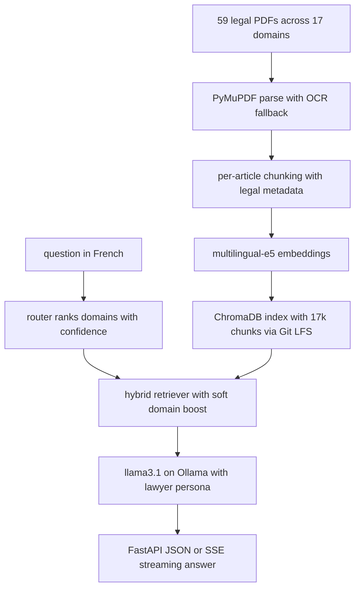

# Juridoc — Offline Tunisian Legal RAG


> A fully offline RAG service that answers **Tunisian legal questions in French**,
> in the voice of a careful Tunisian lawyer — every claim grounded in cited
> code + article, every answer streamed live over HTTP.

**17 domains · 59 PDFs · 17,181 chunks · 63-case eval** — **93.7 %** top-1 routing ·
**98.4 %** top-2 · **100 %** code-level retrieval.


**Fast path** — the pre-built vector index ships in the repo, so no ingestion is needed:

```bash
git clone https://github.com/BenBrahimMazen/Juridoc.git && cd Juridoc
python -m venv .venv && .venv/Scripts/pip install -r requirements.txt   # POSIX: .venv/bin/pip
ollama pull llama3.1 && ollama serve                                    # one-time, ~4.9 GB
python run_api.py        # → http://127.0.0.1:8000/docs
```

*(Windows note: use `.venv\Scripts\pip`. Full setup, gotchas and verification: §5.)*

---

## Table of contents
1. [What this project delivers](#1-what-this-project-delivers)
2. [How it works](#2-how-it-works)
3. [Evaluation & results](#3-evaluation--results)
4. [Design decisions](#4-design-decisions)
5. [Quick start](#5-quick-start)
6. [The corpus & the index](#6-the-corpus--the-index)
7. [Running & testing](#7-running--testing)
8. [Integrating into your application](#8-integrating-into-your-application)
9. [Configuration](#9-configuration)
10. [Limitations](#10-limitations)
11. [Project structure](#11-project-structure)

---

## 1. What this project delivers

- **17-domain legal assistant** — penal, civil/obligations, commercial & companies,
  labour & civil service, fiscal/customs, banking & financial, family & personal
  status, administrative & local authorities, intellectual property, consumer &
  competition, civil procedure & private international law, constitutional, road &
  transport, digital & data, investment, security/compliance (LBC-FT), and health &
  medical ethics.
- **Grounded, citation-backed answers** in formal French (vouvoiement), with a fixed
  5-part structure (Qualification juridique → Fondement légal → Réponse →
  Nuances/exceptions → Recommandation) and a mandatory disclaimer.
- **No fabrication** — answers only from retrieved context; the model refuses when
  the corpus is insufficient.
- **Two query modes over HTTP:**
  - `POST /query` — one-shot JSON answer.
  - `POST /query/stream` — **Server-Sent Events** streaming the answer
    token-by-token (essential for a multi-minute answer in a UI).
- **Colloquial / scenario queries** ("on m'a volé ma voiture…") map to the correct
  formal provisions via query expansion.
- **Idempotent, re-embed-free maintenance** of the corpus and metadata.
- **100% offline at runtime** — no external API or cloud LLM is called when answering.

---

## 2. How it works



**Key design choices**

- **Per-file metadata** (`src/ingestion/file_meta.py`) is the single source of
  truth for each document's `code_name`, primary `domain`, and optional
  `domain_secondary` — a document spanning two areas (e.g. cybercrime →
  `droit_penal` + `droit_numerique_donnees`) carries both.
- **Soft-boost retrieval, no hard filtering.** The router never excludes a domain;
  chunks whose (primary or secondary) domain is among the router's top-2
  predictions get a small score bump. A wrong prediction therefore cannot zero out
  relevant results.
- **Query expansion** maps plain-language scenario phrasings to the formal legal
  vocabulary the keyword re-ranker keys on (e.g. "volé/cambriolé/couteau" →
  `vol`, `effraction`, `escalade`, `armes`, `circonstances`).

---

## 3. Evaluation & results

Measured on a **63-case suite** (`tests/run_eval.py`): 51 formal-phrasing cases and
12 scenario/colloquial cases.

| Metric | Score |
|---|---|
| Domain routing — **top-1** | **93.7 %** (59/63) |
| Domain routing — **top-2** | **98.4 %** (62/63) |
| Retrieval (expected code in top-5) | **100 %** (63/63) |
| Article-level (17 hand-validated cases) | **88.2 %** (15/17) |
| Formal-phrasing subset | 96.1 % top-1 / 100 % top-2 / 100 % retrieval |
| Scenario/colloquial subset | 83.3 % top-1 / 91.7 % top-2 / 100 % retrieval |

### Why these metrics and what they mean

- **Routing is reported at top-1 *and* top-2.** Because retrieval uses the router's
  prediction as a *soft boost* (not a hard filter), the relevant domain being in the
  **top-2** is what actually matters for retrieval quality — and it is 98.4 %. The
  few top-1 "misses" (e.g. an "arnaqué sur internet" query routing to
  `droit_numerique_donnees` instead of `droit_penal`) are caught in the top-2 and
  still retrieve the correct articles.
- **Retrieval is measured at the *code* level** (the correct code present in the
  top-5 chunks). This is lenient by design — it confirms the system finds the right
  body of law. **Article-level precision is high but not perfect**: for
  cross-referenced provisions the exact article can be missed. A real example we
  found and fixed: the Code Pénal aggravated-theft *penalty* articles say
  *"le vol commis avec la réunion des circonstances…"* and don't literally contain
  "escalade"/"couteau", so a "vol à l'aide d'un couteau" query first retrieved the
  wrong article (5-year penalty instead of life). A targeted query expansion
  (escalade/effraction/arme → surface the aggravation articles) now surfaces
  **art. 260** correctly. Edge cases can still occur — always inspect citations.
- **Article-level subset.** 17 cases carry `accept_articles` — the legally correct
  article number(s), each validated by hand against the source texts, must appear
  in the top-5 chunks. The measured **88.2 % (15/17)** is honestly imperfect: both
  misses are real (`cv2` retrieves the COC 102–104 exculpation cluster but not the
  foundational art. 82; `gl6` retrieves procedural Code de la Route articles —
  immobilisation, dépistage — but not the art. 87 drunk-driving sanction).
- **The original 17 formal cases remain 17/17** on routing and retrieval — the move
  to the multi-domain taxonomy introduced no regression.

Reproduce: `python tests/run_eval.py` (fast) or `--generate` (also checks answer
structure/disclaimer, slow). Per-domain and formal-vs-scenario breakdowns are printed.

---

## 4. Design decisions

The "why" behind the main choices — each was empirical, not default.

1. **Soft boost, never hard-filter, on domain routing.** A 17-way classifier will be
   wrong sometimes; the architecture must survive being wrong. Retrieval always
   searches the whole corpus and gives ranked-domain chunks a score bump
   (+0.10 top-1, +0.05 top-2). The failure mode of a wrong route is a slightly
   worse ranking — never a zeroed-out result set.
2. **One ChromaDB collection, domain in metadata.** Versus 17 per-domain
   collections: cross-domain and ambiguous questions ("arnaque en ligne" → penal +
   digital) are just a corpus-wide query with boosts, not a fan-out. Re-tagging a
   domain is a metadata `update`, not a re-embed.
3. **Hybrid re-rank at α = 0.6.** Pure embedding similarity misses exact-term
   legal matches ("validité du contrat" must key on the COC). Over-fetch
   3×top_k, re-rank by `0.6·embedding + 0.4·keyword-overlap`: embedding stays
   dominant, exact terms fix topical near-misses.
4. **llama3.1 over qwen3 — decided by testing, not preference.** On this Ollama
   build, qwen3's thinking mode cannot be disabled: `think:false` is ignored and an
   English chain-of-thought pollutes the answer, while `think:true` burns the token
   budget before answering. llama3.1 answers directly in clean formal French within
   a tiny budget and cites sources — exactly what this grounded persona needs.
5. **e5 with its required `query:` / `passage:` prefixes.** The e5 family is
   trained with them; skipping them quietly degrades retrieval. Embeddings are
   normalized, so cosine is the correct metric.
6. **The index ships with the repo (Git LFS, ~100 MB).** A clone is
   ready-to-query: no 1–2 h CPU ingestion, no "works on my machine" drift between
   indexes. The cost: `chromadb` is pinned to `==1.5.9` because the on-disk format
   is version-bound (§6).
7. **CPU latency treated as a first-class constraint.** Thread count is tuned
   empirically (8 threads ≈ 9 tok/s prompt-eval vs ≈ 6 with 4 — batched matmul
   uses all logical cores; generation is memory-bound at 2–3 tok/s regardless),
   `keep_alive=30m` absorbs the multi-minute cold load, and SSE streaming keeps a
   minutes-long answer usable from a UI instead of a timeout.
8. **Honest evaluation.** Metrics are split top-1/top-2 and formal/colloquial,
   retrieval is labeled as code-level (lenient), and a real article-level miss and
   its fix are documented in §3 rather than hidden.

---

## 5. Quick start

**Prerequisites**
- Python 3.11+
- [Ollama](https://ollama.com/download)
- CPU-only is fine; ~8 GB free RAM (model + vector store + embeddings)

```bash
# 0. One-time: enable Git LFS on your machine (needed to fetch the index)
git lfs install

# 1. Clone (the index comes down automatically via LFS)
git clone https://github.com/BenBrahimMazen/Juridoc.git
cd Juridoc

# 2. Virtual environment + dependencies
python -m venv .venv
# Windows:
.\.venv\Scripts\python.exe -m pip install -r requirements.txt
# macOS/Linux:
# .venv/bin/pip install -r requirements.txt

# 3. Ollama: install, pull the model (~4.9 GB, one-time), start the server
ollama pull llama3.1:latest
ollama serve

# 4. Run the API
# Windows:
.\.venv\Scripts\python.exe run_api.py
# macOS/Linux:
# python run_api.py
# → http://127.0.0.1:8000  (interactive docs at /docs)
```

**Verify the index arrived intact** — `data/chroma/chroma.sqlite3` should be
~100 MB, not a tiny pointer file. If it is a small text file, Git LFS didn't fetch
it; run `git lfs pull`, then:

```bash
python scripts/inventory.py        # chunks/articles per file, grouped by domain
python tests/run_eval.py           # routing + retrieval sanity check (fast)
```

**Ollama on Windows gotcha:** if the tray app (`ollama app.exe`) is running but
`http://localhost:11434` won't respond, it is wedged and holding the instance lock.
Kill it (`taskkill /F /IM "ollama app.exe" /T`) and run `ollama serve` standalone.

> **Lightweight CPU torch** — `sentence-transformers` pulls in torch. On Windows,
> pip fetches the CPU wheel by default (what we want). If you get a CUDA build and
> want to save disk, install a CPU-only torch before the requirements file.

---

## 6. The corpus & the index

| Path | In the repo? | Notes |
|---|---|---|
| `data/chroma/` | **Yes — via Git LFS** | The pre-built vector index (17,181 chunks, embeddings + HNSW). Cloning gives you the exact index the project was built with, so **no ingestion is required** to query. `chromadb` is pinned in `requirements.txt` to match this index format. |
| `pdfs/` | No (gitignored) | The 59 source legal PDFs. Only needed to **re-build or extend** the index; request them from the repo owner if so. |
| `data/processed/ocr_cache/` | No (gitignored) | OCR text caches for scanned PDFs. Only relevant when re-ingesting. |

**To re-build or extend the index** (only if you have the PDFs and want to change
the corpus — not needed for normal use):
1. Place the PDFs under `pdfs/` (any subfolder).
2. Register any new file in `src/ingestion/file_meta.py` (`code_name`, `domain`,
   optional `domain_secondary`).
3. Run:
```bash
python scripts/run_ingestion.py          # all registered PDFs (~1-2h on CPU)
```
The first run downloads the embedding model (~1.1 GB) and embeds every PDF.

> Note: re-running ingestion will **not** produce a byte-identical index (OCR and
> the HNSW graph build have minor run-to-run variability). The committed index is
> the canonical one — keep it unless you intentionally change the corpus.

---

## 7. Running & testing

**Health & domains**
```bash
curl http://127.0.0.1:8000/health
curl http://127.0.0.1:8000/domains
```

**One-shot answer (blocks until the full answer is ready — can take minutes)**
```bash
curl -X POST http://127.0.0.1:8000/query \
  -H "Content-Type: application/json" \
  -d "{\"question\":\"Quel est le délai de préavis en cas de licenciement ?\"}"
```

**Streaming answer (recommended for any UI — tokens arrive live)**
```bash
curl -N -X POST http://127.0.0.1:8000/query/stream \
  -H "Content-Type: application/json" \
  -d "{\"question\":\"Quelle est la peine pour un vol commis à l'aide d'un couteau ?\"}"
```
The SSE stream emits: `event: meta` (routing + retrieved sources) → many
`event: token` (answer deltas) → `event: done` (citations + confidence note).
Comment lines (`: keep-alive`) keep the connection alive during prompt-evaluation.

**Command-line client (no server needed)**
```bash
python scripts/ask.py "Quel est le taux normal de la TVA en Tunisie ?"
```

**Evaluation harness**
```bash
python tests/run_eval.py            # routing + retrieval (fast)
python tests/run_eval.py --generate # + answer structure/disclaimer (slow)
```

---

## 8. Integrating into your application

- **From a browser SPA (Angular, …):** call `POST /query/stream` and consume the
  SSE stream so the answer renders token-by-token. CORS is enabled. Reserve
  `POST /query` for non-interactive/server-side calls.
- **Response contract** (`POST /query`): `answer`, `domain_detected`, `domains`
  (ranked), `confidence`, `citations[]` (code_name, article_number, excerpt,
  similarity), `confidence_note`, `route_reason`, `n_chunks_retrieved`, `model`,
  `elapsed_ms`. See `/docs` for the full OpenAPI schema.
- **Optional overrides:** send `{"question":"…","domain":"droit_penal"}` to force a
  domain boost, or `{"question":"…","top_k":5}` to retrieve more chunks.
- **Auth / sessions / rate-limiting** are intentionally absent — put them in the
  integrating application's gateway.

---

## 9. Configuration

All settings are in `config.py` and overridable via environment variables.

| Variable | Default | Meaning |
|---|---|---|
| `TLR_LLM_MODEL` | `llama3.1:latest` | Ollama model tag |
| `TLR_LLM_THINK` | `0` | Thinking mode (0 = off; required for llama3.1) |
| `TLR_LLM_TEMP` | `0.1` | LLM temperature |
| `TLR_LLM_CTX` | `4096` | Context window (real prompt ≈ 1,100 tokens) |
| `TLR_LLM_MAX_TOKENS` | `400` | Max generated tokens per answer |
| `TLR_LLM_NUM_THREAD` | `8` | Inference threads (8 > 4 for prompt-eval here) |
| `TLR_LLM_TIMEOUT` | `600` | Per-call HTTP timeout (seconds) |
| `TLR_LLM_KEEP_ALIVE` | `30m` | Keep the model resident between calls |
| `TLR_EMBED_MODEL` | `intfloat/multilingual-e5-base` | Embedding model |
| `TLR_TOP_K` | `3` | Chunks returned to the LLM |
| `TLR_HYBRID_ALPHA` | `0.6` | Embedding vs keyword blend in re-rank |
| `TLR_POOL_FACTOR` | `3` | Over-fetch = `TOP_K × POOL_FACTOR` candidates |
| `TLR_DOMAIN_BOOST` | `0.10` | Score bump for chunks in the top-1 predicted domain |
| `TLR_DOMAIN_BOOST_SECOND` | `0.05` | Score bump for the top-2 predicted domain |
| `TLR_ROUTER_KW_WEIGHT` | `0.5` | Keyword vs embedding weight in domain scoring |
| `TLR_ROUTER_LOW_CONF` | `0.55` | Below this top-1 margin → "low confidence" |
| `TLR_OCR` | `1` | OCR fallback for scanned pages (0 = off) |
| `OLLAMA_HOST` | `http://localhost:11434` | Ollama base URL |
| `TLR_API_HOST` | `127.0.0.1` | API bind host |
| `TLR_API_PORT` | `8000` | API port |
| `TLR_API_CORS` | `*` | Comma-list of allowed CORS origins |
| `TLR_API_WARM` | `1` | Warm the LLM into RAM on startup (0 = off) |

---

## 10. Limitations

- **CPU latency.** A full structured answer takes several minutes on a 4-core CPU
  (prompt-evaluation ≈ 6–9 tok/s, generation ≈ 2–3 tok/s). **Use the streaming
  endpoint** from any UI; do not block on `/query` interactively.
- **Article-level retrieval precision** — see §3. Inspect citations before relying
  on a specific figure.
- **French only** (Arabic is out of scope for this phase; nothing hard-blocks it).
- **Corpus is a snapshot** — yearly-changing texts (Loi de Finances, BCT
  circulaires, CMF rules) are not refreshed automatically; replace the PDF and
  re-ingest.
- **Heuristic router** (keyword + embedding), not LLM-based — genuinely ambiguous
  queries can route to the wrong top-1; the soft boost + top-2 keep retrieval correct.
- **OCR artifacts** — OCR'd pages may have minor spacing/accent loss.
- **Non-standard article numbering** — a couple of documents (e.g. the Code de
  Déontologie Médicale, numbered R.4127-x) are indexed as whole-text chunks without
  per-article numbers, so their citations omit the article number.
- **No auth / sessions / rate-limiting** — by design; the integrating application is
  expected to own those concerns.

---

## 11. Project structure

```
Juridoc/
├── config.py                       # settings + paths (env-overridable)
├── run_api.py                      # uvicorn launcher (production API)
├── requirements.txt
├── pdfs/                           # source PDFs (gitignored — provide your own)
├── data/                           # ChromaDB index (LFS) + OCR cache (gitignored)
├── src/
│   ├── ingestion/                  # pdf_parser(+OCR), chunker, code_names, file_meta, pipeline
│   ├── embeddings/                 # e5 wrapper (Chroma-compatible)
│   ├── vectorstore/                # ChromaDB access (idempotent upsert)
│   ├── routing/                    # domains (taxonomy), router (ranked)
│   ├── retrieval/                  # retriever (soft boost), query_expand
│   ├── generation/                 # ollama_client (streaming), prompts (persona), answerer
│   └── api/                        # FastAPI app + schemas (CORS, SSE, /domains, /health, /ingest)
├── scripts/
│   ├── run_ingestion.py            # ingest (all / domain / --file / --dir / --force-ocr)
│   ├── migrate_domains.py          # re-tag domain metadata in place (no re-embed)
│   ├── refresh_code_names.py       # re-apply code_name edits in place
│   ├── inventory.py                # chunks/articles per file by domain
│   ├── inspect_code_names.py       # dump first-page text to help curate names
│   ├── ocr_pdf.py                  # pre-OCR a scanned PDF to cache
│   └── ask.py                      # end-to-end CLI client
└── tests/
    ├── run_eval.py                 # routing + retrieval (+ generation) harness
    ├── eval_cases.json             # 63 cases (formal + scenario)
    └── test_chunker.py             # chunker unit tests
```
